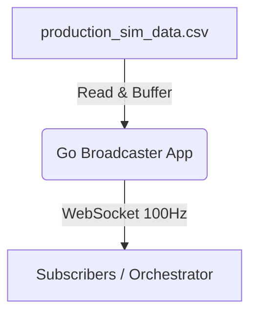

# Broadcaster

A high-frequency Go-based WebSocket broadcaster designed to stream simulated medical data from CSV files for real-time inference, specifically calibrated to 100Hz.

## Architecture



## Usage Instructions

1. Ensure the `production_sim_data.csv` is correctly placed via volumes. 
2. Build and start the container using Docker Compose:
    ```bash
    docker-compose up --build go-broadcaster
    ```
3. Connect immediately to `ws://localhost:8080/` to receive data streams at exactly 100Hz.

## Requirements

- Docker
- Docker Compose
