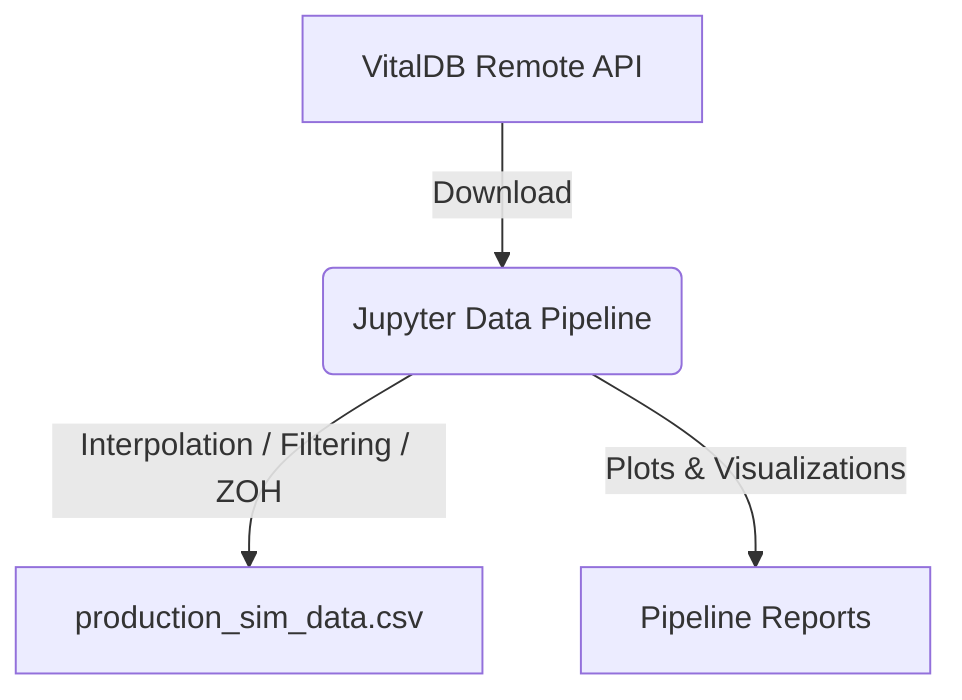

# Data Extraction

A Python-based Jupyter framework to extract, cleanly filter, and standardize raw VitalDB telemetry streams (such as waveforms) to generate simulation datasets ready for real-time models. Includes Butterworth filtering and handling of missing signals (zero-order hold).

## Architecture



## Usage Instructions

1. Build and run the Jupyter container via Docker compose, or simply build the image and run it:
    ```bash
    docker run -p 8888:8888 data_extraction_image
    ```
    (Or follow the `docker-compose.yml` if configured).
2. Access the Jupyter environment at `http://localhost:8888`.
3. Open and sequentially execute `pipeline.ipynb` to generate `production_sim_data.csv`.

## Requirements

- Docker
