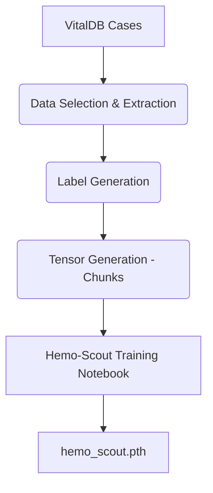

# Hemo-Scout

This component features both the dataset engineering extraction code and the modeling scripts for Hemo-Scout: a specialized CNN designed to classify pre-crash hemodynamic patterns (cardiovascular crashes).

## Architecture



## Usage Instructions

To generate the datasets:
1. Build the dataset generation pipeline using the configured Dockerfile:
    ```bash
    docker-compose build hemo-dataset
    docker-compose up hemo-dataset
    ```
This will extract data, apply 'Time-Machine' labeling, and generate training chunks.

To train the model:
1. Load `hemo.ipynb` into a Jupyter environment equipped with PyTorch.
2. Ensure generated chunk tensors are attached.
3. Train to produce `hemo_scout.pth`.

## Requirements

- Docker
- Docker Compose
- Jupyter Notebook Runtime (for modeling)
