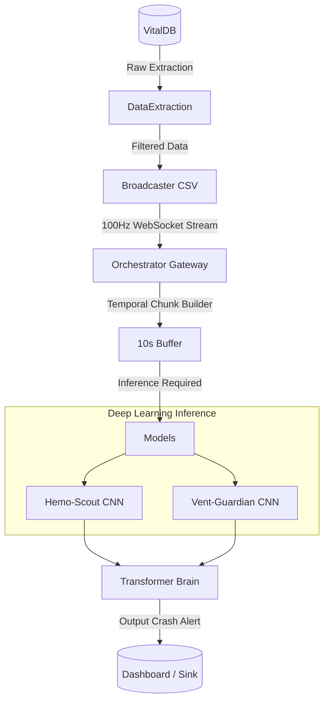

# Medical Diagnostics Orchestration Pipeline

A fully-integrated, real-time machine learning architecture configured to simulate and analyze high-frequency medical datastreams (e.g. from telemetry monitors and mechanical ventilators). 

Through synchronized components written in Go, Python, and NestJS, it extracts signal patterns at 100Hz, aligns temporal blocks, and feeds them into predictive Deep Learning models that aim to identify impending Hemodynamic and Respiratory system crashes.

## Subprojects Index

- [Broadcaster](./Broadcaster) - High-throughput Go WebSocket streaming server mimicking real-life hardware frequencies.
- [Data Extraction](./DataExtraction) - Standardized Python pipelines to cleanly structure and filter `VitalDB` records into replayable CSV logs.
- [Hemo-Scout](./Hemo) - The cardiovascular analysis core containing dataset ingestion pipelines and the specific CNN model (`hemo_scout.pth`).
- [Vent-Guardian](./Respiratory) - The respiratory failure modeling infrastructure comprising label-generation scripting and PyTorch CNN topology.
- [Orchestrator](./orchestrator) - The event-driven NestJS gateway responsible for catching the raw 100Hz WebSockets, blocking them into valid chunks, and firing inferences.
- [Transformer Brain](./Transformer) - The unifying Micro-Transformer component that solves prediction conflicts between CNN models to produce a master trajectory output.

## Global Architecture



## Usage Instructions

The entire inference application is dockerized for reliable multi-language reproduction.

1. Install [Docker](https://docs.docker.com/get-docker/) and [Docker Compose](https://docs.docker.com/compose/).
2. Run the main orchestration and broadcast group from the root:
    ```bash
    docker-compose up --build
    ```
3. Read the individual subproject modules to interact with and process dataset generations natively (e.g. `docker-compose build hemo-dataset`).

## Requirements

- **Docker & Docker Compose**: The entire pipeline avoids host-system polluting by wrapping dependencies. Ensure the daemon has enough RAM to comfortably run NestJS + Go server alongside potential AI containers.
