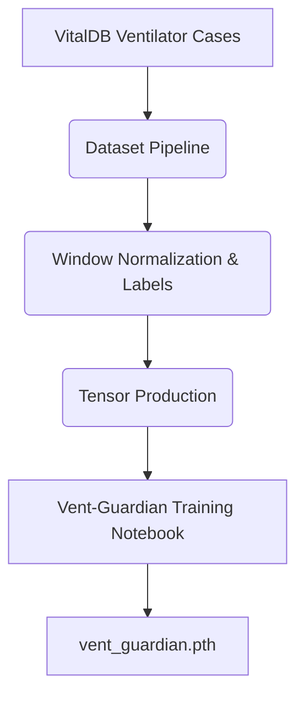

# Vent-Guardian

This subproject handles the dataset acquisition and Convolutional Neural Network (CNN) modeling for Vent-Guardian, predicting respiratory distress or ventilation failures based on mechanical ventilator data streams.

## Architecture



## Usage Instructions

To construct the datasets:
1. Run the dataset generation container with Docker Compose:
    ```bash
    docker-compose build vent-dataset
    docker-compose up vent-dataset
    ```
The pipeline automatically provisions `.npy` tensor chunks suitable for multi-dimensional deep learning.

To run model training:
1. Start a PyTorch computing environment for `vent.ipynb`.
2. Process the datasets to train the internal layers and export the verified `vent_guardian.pth` structure.

## Requirements

- Docker
- Docker Compose
- Jupyter Notebook Runtime (for modeling)
