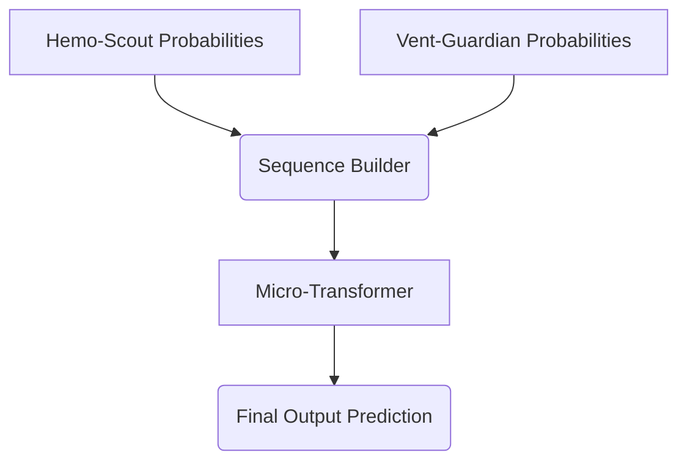

# Transformer Brain

The final predictive layer of the application. It acts as a Conflict Resolver Micro-Transformer, taking the probabilistic output arrays generated by the `Hemo-Scout` and `Vent-Guardian` CNNs and combining them across temporal sequences to issue the ultimate patient trajectory prediction (Crash vs. Secure).

## Architecture

## Usage Instructions

1. Start a Jupyter / PyTorch environment mapping this directory.
2. Initialize and open `transformer_brain.ipynb` or the V2 depending on configuration constraints.
3. Feed in the model embeddings or inference results from the upstream components.
4. Execute the training and evaluation loop. Note: High-frequency data alignment across sequences is strictly required.

## Requirements

- Python 3.10+
- PyTorch
- Jupyter Notebook Runtime
