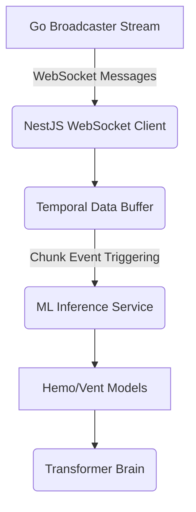

# Orchestrator

The intelligent central nervous system built in NestJS that ingests the 100Hz stream from the Broadcaster, buffers instances into distinct temporal "chunks," and distributes valid data blocks down to the Hemo and Vent learning models for real-time categorization.

## Architecture



## Usage Instructions

1. Start the Orchestrator with the standard Docker configuration:
    ```bash
    docker-compose up orchestrator
    ```
2. The orchestrator inherently expects the `go-broadcaster` to be fully operational and available on port 8080 (handled seamlessly via docker-compose networking).
3. Live endpoints and application health exist at `http://localhost:3000`.

## Requirements

- Docker
- Docker Compose
